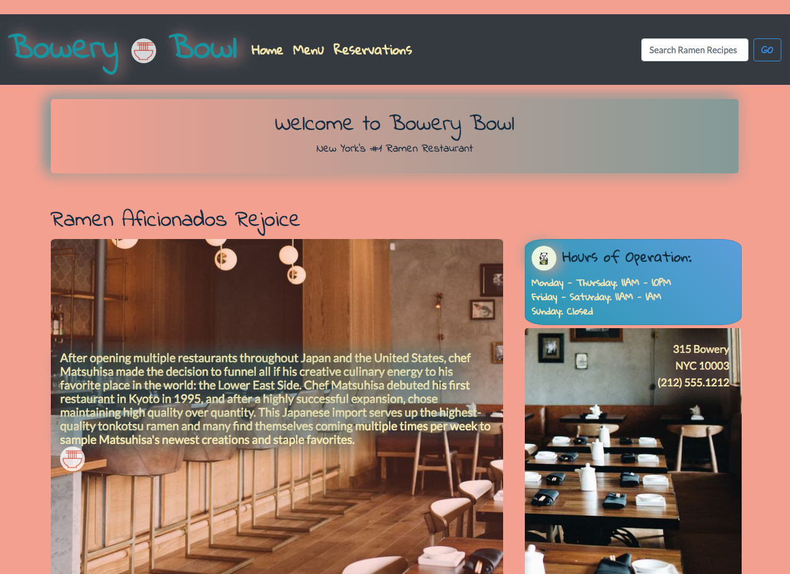
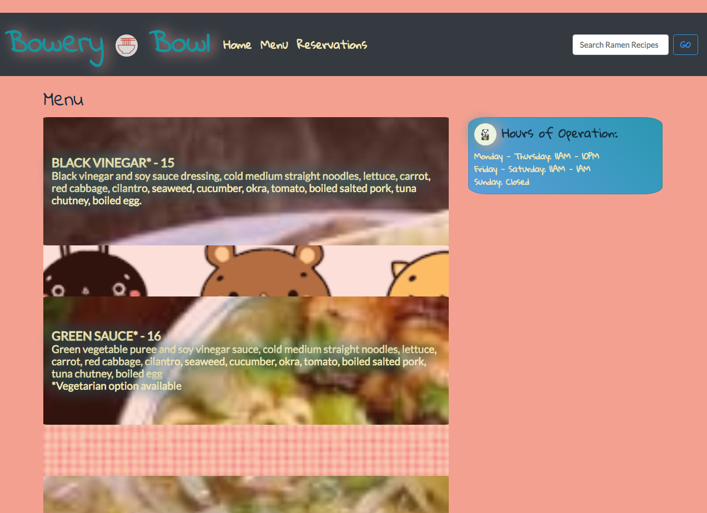
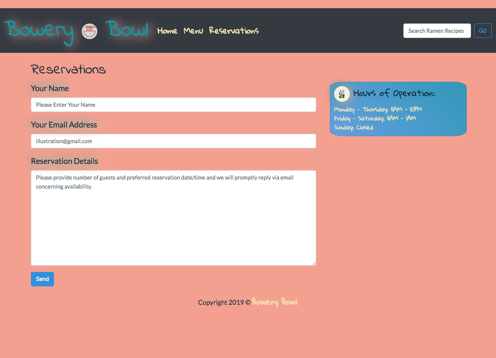
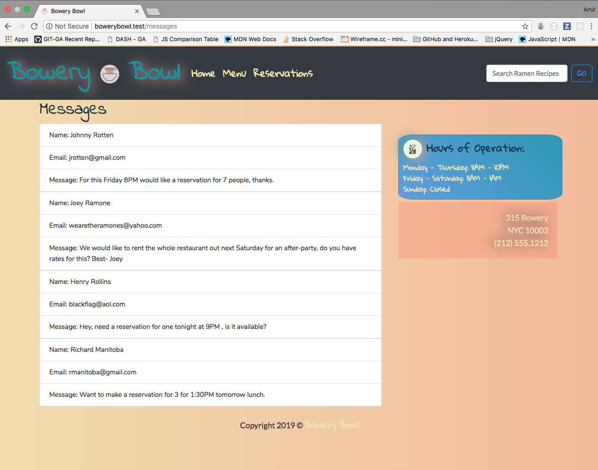
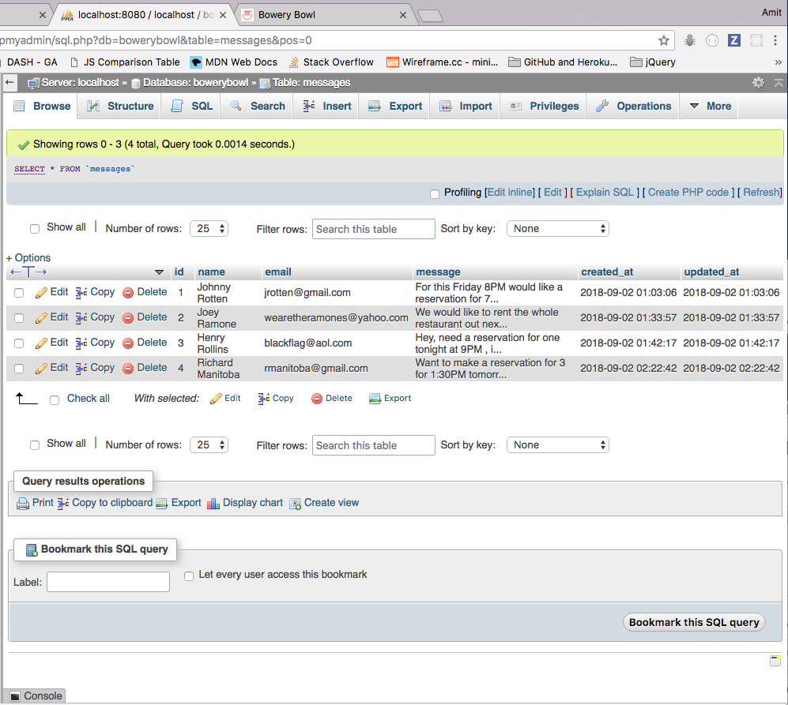

  

Scroll Down to See More Screen Shots:

# [Bowery Bowl](http://bowerybowl.herokuapp.com/)
### "New York's #1 Ramen Restaurant"

Author: [Amit Zaman](https://amitzaman.com)

#### Technologies Used:
##### Laravel
##### mySQL
##### phpMyAdmin
##### Bootstrap
##### SASS
##### VUE
##### Valet
##### XAMPP - Apache
##### Heroku

#### This restaurant site has all workable menus and the Reservations page records all input messages and alerts/flash messages user when no required informations is entered or when required information is sent/received.

#### Messages are viewable in phpMyAdmin and if locally going to the site: bowerybowl.test/messages all the input messages from different users can be viewed.  Although ClearDB Add-On was added for mySQL and Heroku functionality, this did not work on Heroku via the Heroku Bowery Bowl link (located above and below).

#### This site used SASS and features infinite color-changing background and my current favorite CSS feature, parallax.

#### To see the app's Heroku deployment, click the Bowery Bowl name/link above or go [here](http://bowerybowl.herokuapp.com/).

##### [Amit](https://github.com/amitzed)

  

  

  

  

